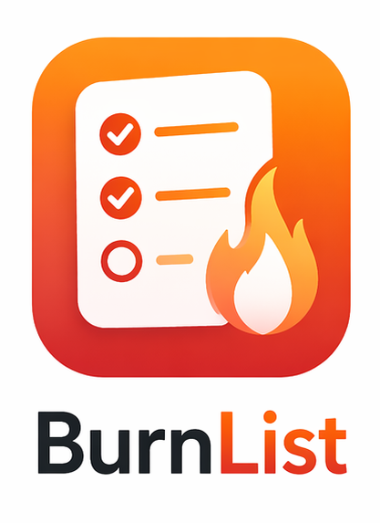

<p align="center">
  
</p>

# BURNLIST

A focused iOS app for burning through your daily tasks. Syncs your checklist from a published Google Sheet — no backend, no account, no noise.

## Features

- **Google Sheets sync** — paste any published Google Sheet URL and pull to refresh; the app auto-converts it to a CSV export URL
- **Burn animation** — completing a task triggers a fire effect
- **Task history** — past days are shown below today's list, expandable with per-day completion percentages
- **Home screen widget** — small, medium, and large sizes; tasks can be toggled directly from the widget
- **Daily reminders** — optional push notification at a configurable time (default 9:00 AM)
- **Themes** — five built-in themes: Cyberpunk, Vaporwave, Terminal, Blood Red, Minimal
- **Offline-resilient** — on network failure, cached tasks remain visible with a status note

## Requirements

- iOS 18.0+
- Xcode 16+

## Getting Started

### 1. Set up your Google Sheet

Create a sheet with this structure:

| Date       | Task One | Task Two | Task Three |
|------------|----------|----------|------------|
| 2024-01-15 | Go for a run | Read 30m | Inbox zero |
| 2024-01-16 | Go for a run |          | Inbox zero |

Rules:
- The first row is the header. One column must be named **Date** (case-insensitive).
- Every other column is treated as a task. The column header becomes the task title.
- A task only appears for a given day if its cell is non-empty.
- Date values can be in `YYYY-MM-DD`, `MM/DD/YYYY`, `M/D/YYYY`, or `DD-MMM-YYYY` format.

### 2. Publish the sheet as CSV

In Google Sheets: **File → Share → Publish to web → Comma-separated values (.csv) → Publish**

Copy the resulting URL.

### 3. Paste the URL in the app

Open **Settings** (gear icon) → **Google Sheet** section → paste the URL → **Save Source URL** → **Refresh Now**.

The app accepts any of these URL formats and normalises them automatically:
- Standard `docs.google.com/spreadsheets/d/…` edit URLs
- `…/pub?output=csv` publish URLs
- `…/export?format=csv` export URLs

## Architecture

```
Google Sheet (CSV)
    └── TaskSyncService        # fetches URL, falls back to cache on failure
            └── TaskSheetParser    # parses CSV, identifies date + task columns
                    └── ChecklistStore     # persists to app group UserDefaults
                            └── AppModel       # @MainActor view model
                                    └── UI / Widget
```

**Key modules:**

| Module | Role |
|--------|------|
| `AppModel` | Central `@MainActor` / `ObservableObject` coordinating sync, persistence, and reminders |
| `ChecklistStore` | Reads/writes tasks, history, configuration, and snapshots via app group UserDefaults (`group.com.example.BurnList.shared`) |
| `TaskSyncService` | Fetches the CSV, delegates to `TaskSheetParser`, saves the snapshot; `refreshPreservingCache` keeps cached data visible on error |
| `TaskSheetParser` | Dynamically identifies the Date column and task columns; emits tasks keyed by `dateID|taskID` compound ID |
| `AppConfiguration` | Persisted settings: sheet URL, theme, reminder time |
| `BurnListWidget` | WidgetKit extension sharing data through the same app group; refreshes after 00:05 each day; supports `ToggleTaskIntent` for interactive toggling |

## Build & Test

```bash
# Build
xcodebuild -project BurnList.xcodeproj -scheme BurnList -configuration Debug build

# Run all tests
xcodebuild -project BurnList.xcodeproj -scheme BurnList \
  -destination 'platform=iOS Simulator,name=iPhone 16' test

# Run a single test class
xcodebuild -project BurnList.xcodeproj -scheme BurnList \
  -destination 'platform=iOS Simulator,name=iPhone 16' \
  -only-testing:BurnListTests/ChecklistStoreTests test
```

## Project Structure

```
BurnList/
├── App/
│   ├── BurnListApp.swift
│   └── AppModel.swift
├── Views/
│   ├── ChecklistHomeView.swift
│   ├── SettingsView.swift
│   └── BurnEffect.swift
├── Notifications/
│   └── ReminderScheduler.swift
├── Sync/
│   └── TaskSyncService.swift
└── Resources/
    ├── Assets.xcassets
    ├── Info.plist
    └── BurnList.entitlements

BurnListWidget/
├── BurnListWidget.swift
├── ToggleTaskIntent.swift
└── BurnListWidget.entitlements

Shared/                          # Compiled into both targets
├── Models/
│   ├── DailyTask.swift
│   ├── DailyChecklistSnapshot.swift
│   └── AppConfiguration.swift
├── Persistence/
│   └── ChecklistStore.swift
├── Sync/
│   └── TaskSheetParser.swift
└── Support/
    ├── AppConstants.swift
    ├── CyberpunkTheme.swift     # AppTheme + all built-in themes
    └── DateFormatting.swift

BurnListTests/
├── ChecklistStoreTests.swift
└── TaskSheetParserTests.swift
```
